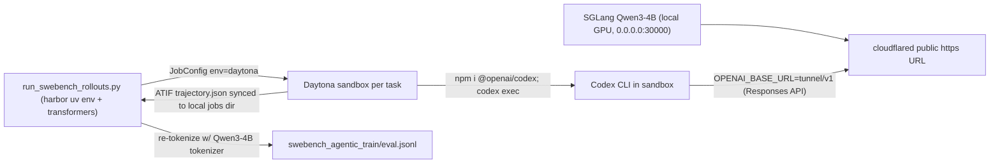

# Qwen3-4B DFlash - Agentic SWE-bench Rollout (Codex agent, Daytona sandboxes)

## Introduction

This document is a runbook for **Phase A** of the agentic DFlash pipeline for `Qwen/Qwen3-4B`:
generate pretokenized agentic SWE-bench trajectories using the **Codex** agent, then re-tokenize
them into train/eval JSONL that [`run_qwen3_4b_dflash_swebench.sh`](../../examples/run_qwen3_4b_dflash_swebench.sh)
(Phase B) consumes.

It targets an environment where **Docker cannot run locally**, so the per-task agent sandboxes are
offloaded to the **Daytona** cloud sandbox provider. The target model is served locally on GPU and
exposed to the remote sandboxes through an outbound tunnel.

> Scope: this runbook stops at producing the rollout JSONL. Training (Phase B) is covered by
> [`run_qwen3_4b_dflash_swebench.sh`](../../examples/run_qwen3_4b_dflash_swebench.sh).

For a completed run audit, including the exact commands, outputs, and tokenization/loss-mask
validation evidence, see
[`qwen3-4b-dflash-swebench-codex-reproduction.md`](./qwen3-4b-dflash-swebench-codex-reproduction.md).

## Why this shape (environment constraints)

The pipeline normally runs Harbor SWE-bench tasks in local Docker sandboxes. On an unprivileged
Kubernetes pod that is not possible, which drives every other decision here:

- **No local Docker.** The pod is unprivileged (`CapEff` lacks `cap_sys_admin` / `cap_net_admin`,
  `unshare -n` fails with "Operation not permitted", `/sys/fs/cgroup` is read-only, there is no
  `/dev/fuse`). Neither rootful nor rootless `dockerd` can start. Harbor's only local sandbox is
  Docker, so task sandboxes are offloaded to **Daytona**, which builds the task
  `environment/Dockerfile` directly (`Image.from_dockerfile`) and pulls the `swebench/...` base
  image - no pre-registered template required.
- **The agent runs inside the remote sandbox.** Harbor's Codex agent `npm install`s
  `@openai/codex` *inside* the Daytona sandbox and runs `codex exec` there, connecting to
  `OPENAI_BASE_URL`. `127.0.0.1` is unreachable from Daytona, so the locally served SGLang target
  must be exposed via an **outbound tunnel** (e.g. a cloudflared quick tunnel; the pod's
  capabilities allow outbound connections and binding).
- **Driver hardcodes Docker.** [`scripts/run_swebench_rollouts.py`](../../scripts/run_swebench_rollouts.py)
  builds `EnvironmentConfig(type=EnvironmentType.DOCKER, ...)`, so it needs a small patch to select
  Daytona.
- **Codex wire API.** Current Codex CLI releases use the OpenAI *Responses* API and reject the
  legacy `wire_api = "chat"` provider setting. SGLang 0.5.14 serves `/v1/responses`, so the rollout
  should keep `CODEX_WIRE_API=responses` by default. The Harbor Codex agent patch below leaves an
  env-gated chat-provider path available only for older pinned Codex builds that still support it.

## Architecture



## Prerequisites

- 1x GPU (Qwen3-4B is dense; tp=1 fits on a single H100/80GB; ~8GB download on first serve).
- `uv`, `sglang`, and `transformers` available; Harbor checked out at `/persistent/harbor`.
- A **`DAYTONA_API_KEY`** exported in the environment before the rollout.
- Likely the **`HARBOR_NETWORK` egress coupon** applied to your Daytona account: each sandbox must
  reach Docker Hub (image build), npm / nodejs.org (Codex self-install), and the tunnel URL.

## Required code changes

These three edits are required before the rollout will run against Daytona with Codex.

### 1. Driver: select the environment + pass the Codex wire API hint

In [`scripts/run_swebench_rollouts.py`](../../scripts/run_swebench_rollouts.py), add CLI args
(near the orchestration group):

```python
p.add_argument("--environment", type=str, default="docker",
               help="harbor EnvironmentType (docker, daytona, modal, ...).")
p.add_argument("--env-kwargs", type=str, default=None,
               help="JSON dict merged into EnvironmentConfig.kwargs (provider-specific).")
```

In `run_rollouts`, replace the hardcoded environment:

```python
environment=EnvironmentConfig(
    type=EnvironmentType(args.environment),
    force_build=args.force_build,
    delete=not args.keep_containers,
    kwargs=json.loads(args.env_kwargs) if args.env_kwargs else {},
),
```

And add the wire-API hint to the Codex agent's `env`:

```python
env={
    "OPENAI_BASE_URL": args.api_base,
    "OPENAI_API_KEY": args.openai_api_key or "sk-local-sglang",
    "CODEX_WIRE_API": os.environ.get("CODEX_WIRE_API", "responses"),
},
```

### 2. Harbor Codex agent: keep an env-gated chat-wire model provider

In [`/persistent/harbor/src/harbor/agents/installed/codex.py`](/persistent/harbor/src/harbor/agents/installed/codex.py),
extend `config_toml_block` so that, when the agent env `CODEX_WIRE_API=chat`, it writes a custom
provider instead of bare `openai_base_url` (opt-in, reversible, and intended only for older Codex
CLI builds that still accept `wire_api = "chat"`):

```toml
model_provider = "sglang"
[model_providers.sglang]
name = "sglang"
base_url = "${OPENAI_BASE_URL}"
wire_api = "chat"
env_key = "OPENAI_API_KEY"
```

Leave `CODEX_WIRE_API=responses` for current Codex CLI releases and SGLang `/v1/responses` (no
provider block).

### 3. Rollout script knobs

In [`examples/run_qwen3_4b_dflash_swebench_rollout.sh`](../../examples/run_qwen3_4b_dflash_swebench_rollout.sh)
add overridable knobs:

- `ROLLOUT_ENVIRONMENT` (default `docker`) -> passed as `--environment`.
- `ROLLOUT_API_BASE` -> the tunnel URL passed as `--api-base` (the local `/health` check stays on
  `127.0.0.1`).
- `ROLLOUT_PYTHON` -> run the driver inside Harbor's uv env with transformers, e.g.
  `uv run --project /persistent/harbor --with transformers python`.

## Step-by-step

### Step 1. Install Harbor + Daytona SDK

```shell
cd /persistent/harbor
uv sync --extra daytona
uv run python -c "import harbor, daytona; print('ok')"
```

### Step 2. Apply the code changes

Apply the three patches in [Required code changes](#required-code-changes).

### Step 3. Serve Qwen3-4B locally

```shell
export HF_HOME=/persistent/hf-cache
TARGET_MODEL=Qwen/Qwen3-4B \
SERVED_NAME=qwen3-4b \
SERVE_TP=1 \
SERVE_TOOL_CALL_PARSER=qwen25 \
bash examples/run_qwen3_4b_dflash_swebench_rollout.sh serve
```

This binds `0.0.0.0:30000`. Wait for `/health` to return OK (first run downloads ~8GB).

### Step 4. Expose the server via a tunnel

Start a cloudflared quick tunnel to `:30000` and capture the public URL:

```shell
cloudflared tunnel --url http://127.0.0.1:30000
# -> https://<random>.trycloudflare.com
```

Use `https://<random>.trycloudflare.com/v1` as `ROLLOUT_API_BASE` below.

### Step 5. Materialize SWE-bench tasks

```shell
cd /persistent/harbor/adapters/swebench
uv run swebench --task-dir /persistent/harbor/datasets/swebench-verified --limit 20
```

This downloads the public `princeton-nlp/SWE-bench_Verified` dataset and writes 20 task dirs. No
Docker needed.

### Step 6. Smoke gate (1 task)

```shell
export DAYTONA_API_KEY=<your-key>
TARGET_MODEL=Qwen/Qwen3-4B \
SERVED_NAME=qwen3-4b \
ROLLOUT_AGENT=codex \
ROLLOUT_ENVIRONMENT=daytona \
ROLLOUT_API_BASE=https://<random>.trycloudflare.com/v1 \
ROLLOUT_PYTHON="uv run --project /persistent/harbor --with transformers python" \
CODEX_WIRE_API=responses \
SWEBENCH_LIMIT=1 \
ROLLOUT_N_CONCURRENT=1 \
bash examples/run_qwen3_4b_dflash_swebench_rollout.sh rollout
```

Verify: a Daytona sandbox builds, Codex installs and runs, `agent/trajectory.json` syncs back to the
local jobs dir, and the driver emits at least one pretokenized row.

### Step 7. Small batch (10-20 tasks)

```shell
export DAYTONA_API_KEY=<your-key>
TARGET_MODEL=Qwen/Qwen3-4B \
SERVED_NAME=qwen3-4b \
ROLLOUT_AGENT=codex \
ROLLOUT_ENVIRONMENT=daytona \
ROLLOUT_API_BASE=https://<random>.trycloudflare.com/v1 \
ROLLOUT_PYTHON="uv run --project /persistent/harbor --with transformers python" \
CODEX_WIRE_API=responses \
SWEBENCH_LIMIT=20 \
ROLLOUT_N_CONCURRENT=4 \
MAX_LENGTH=16384 \
bash examples/run_qwen3_4b_dflash_swebench_rollout.sh rollout
```

Outputs:

- `cache/dataset/swebench-agentic-qwen3-4b/swebench_agentic_train.jsonl`
- `cache/dataset/swebench-agentic-qwen3-4b/swebench_agentic_eval.jsonl`

### Step 8. Validate

Check the rollout summary line (`trials / with_tokens / missing_tokens / resolved / segments /
windows`) and sanity-check that JSONL rows carry parallel `input_ids` and `loss_mask` lists of equal
length with a non-zero `loss_mask` sum.

## Next: train (Phase B)

```shell
bash examples/run_qwen3_4b_dflash_swebench.sh setup
bash examples/run_qwen3_4b_dflash_swebench.sh prepare
bash examples/run_qwen3_4b_dflash_swebench.sh watchdog
```

## Risks / notes

- **Daytona egress limits** can break the in-sandbox image build / Codex npm install / reaching the
  tunnel. Apply the `HARBOR_NETWORK` coupon (or set `extra_allowed_hosts`).
- **Image weight.** SWE-bench Verified per-instance images are ~1-2GB each; 20 tasks is meaningful
  Daytona build time and credits.
- **Wire API compatibility.** Current Codex CLI releases reject `wire_api = "chat"`; use
  `CODEX_WIRE_API=responses` with SGLang's `/v1/responses`. Only try `CODEX_WIRE_API=chat` if you
  intentionally pin an older Codex CLI that still accepts the setting.
- **Tunnel stability.** A dropped tunnel mid-run fails the affected trials; prefer a stable named
  tunnel for larger runs.
